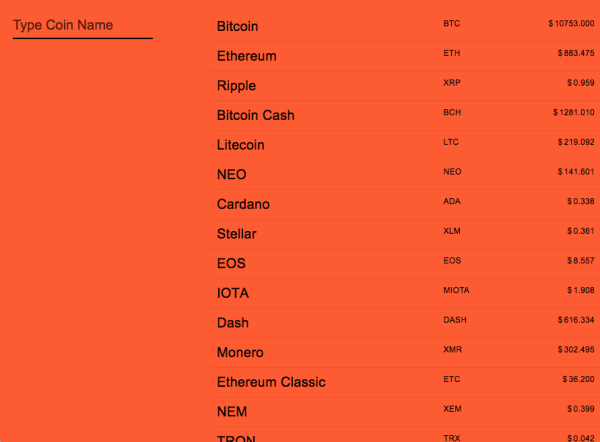
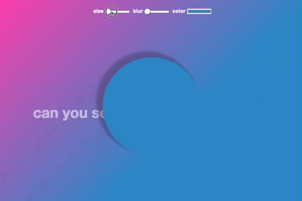
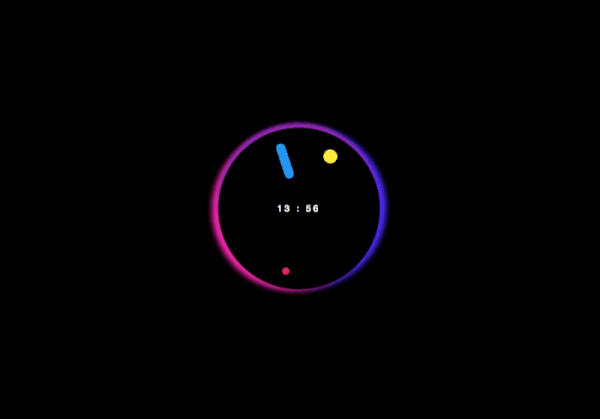
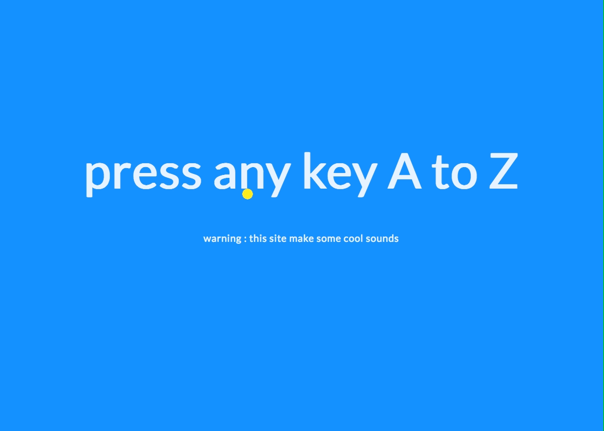

## JavaScript30 project list

프레임워크, 라이브러리 없이 순수 자바스크립트로 만드는 재밌는 프로젝트들 시작.
[JavaScript30 challenge](https://javascript30.com/)

No frameworks, no libraries, no wrappers... just pure VanillaJS ;)

---

## Table Of Contents

7. Array Cardio 2

    [project result](https://yogicat.github.io/JavaScript30/07-array2/)

    `array.some`, `array.every`, `array.find`, `array.splice`, `array.slice`
    array를 반복 연습했다. 원본배열이 바뀌는지 꼭 확인하고 사용할것.
    

---

6. Type Ahead

    [project result](https://yogicat.github.io/JavaScript30/06-typeAhead/)

    

    [Awesome-json-datasets](https://github.com/jdorfman/awesome-json-datasets)에서 원하는 데이터를 fetch로 불러와서 검색하는 간단한 폼을 만들었다. 정규표현식으로 찾는 방법과 입력한 값을 `replace`함수를 통해 highlight하는 방법을 배웠다. `input`에서 `outline`속성과 `:focus`에 대해 알게 되었다.

---

4. Array Cardio 1

    [project result](https://yogicat.github.io/JavaScript30/04-array/)

    Array 연습을 통해 다양한 해결법을 익힐 수 있었다. 반복 복습 필요함!

---

3. CSS Variables

    [project result](https://yogicat.github.io/JavaScript30/03-css/)

    

    새로 생긴 CSS 변수 기능을 활용해 `input`함께 값이 실시간 변동되는 사이트를 만들었다. 슬라이더 CSS로 선택하고 모양을 바꾸는 법을 공부했다.

---

2. CSS + Javascript Clock

    [project result](https://yogicat.github.io/JavaScript30/02-clock)

    

    setInterval을 통해 시계를 만들었다. css의 `box-shadow`를 겹겹이 쌓아 재밌는 효과를 만들어보았다.

---

1. JavaScript Drum Kit

    [project result](https://yogicat.github.io/JavaScript30/01-drumkit)

    

